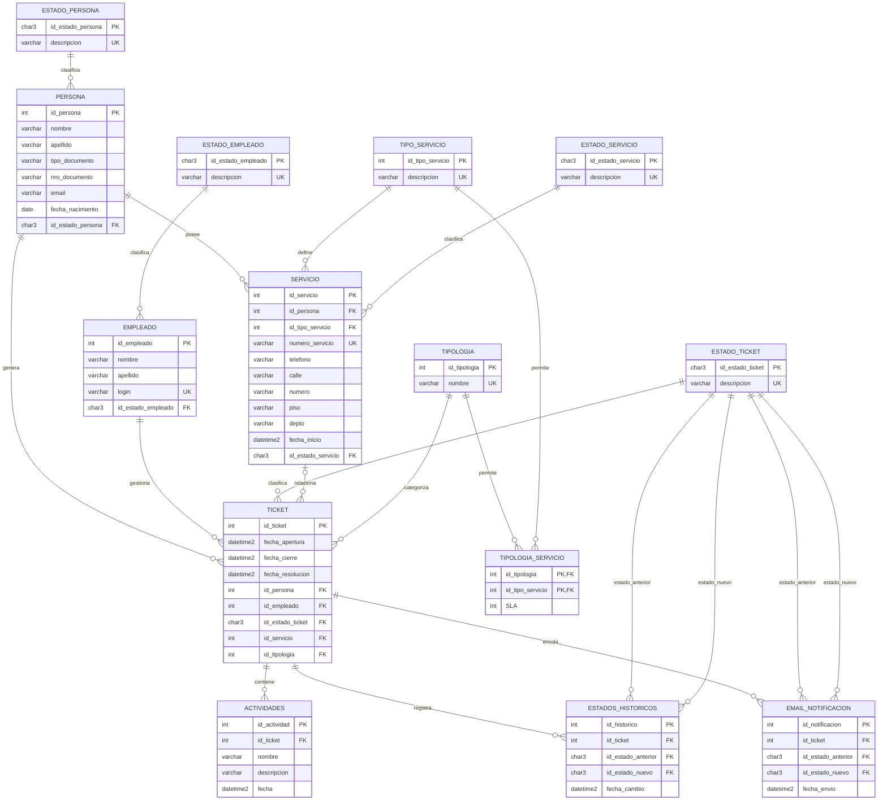
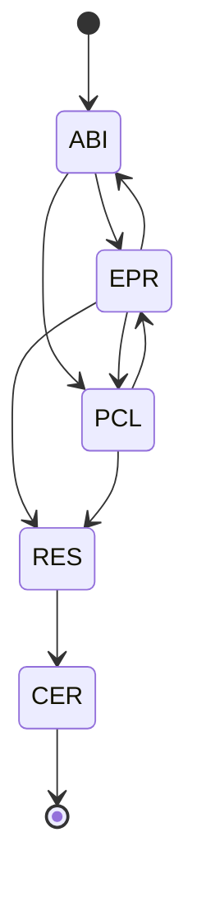
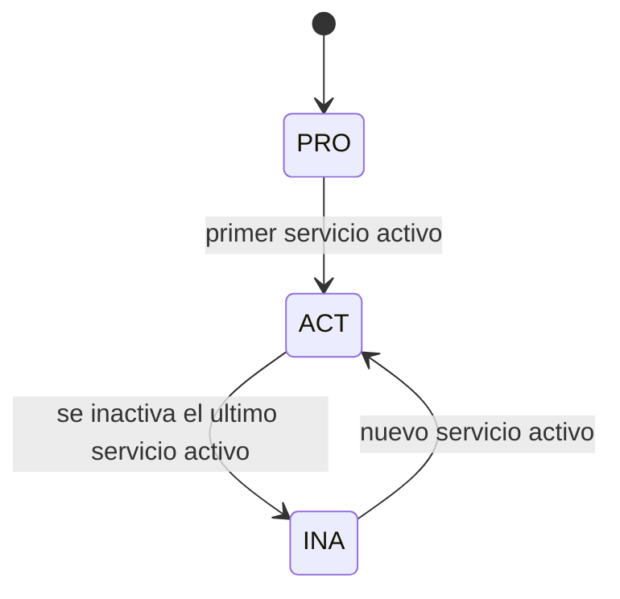

# Modelo de Base de Datos

[English version](database-model.md)

Este documento describe el modelo de la versión de portfolio de **Telecom Call Center Database**.

El proyecto modela personas/prospectos, servicios de telecomunicaciones, tickets de soporte, empleados, tipologías, historial de estados, actividades, reglas de SLA y notificaciones de email pendientes.

## Vista general de entidades y relaciones



## Máquina de estados del ticket

El flujo definitivo es:



| Código | Significado |
|---|---|
| `ABI` | Abierto |
| `EPR` | En Proceso |
| `PCL` | Pendiente de Cliente |
| `RES` | Resuelto |
| `CER` | Cerrado |

## Ciclo de estado de una persona

Las personas se crean inicialmente como prospectos.



| Código | Significado |
|---|---|
| `PRO` | Prospecto |
| `ACT` | Activo |
| `INA` | Inactivo |

## Modelo de SLA

El SLA no se almacena directamente en el ticket.

Pertenece a la relación de compatibilidad:

```text
Tipologia + Tipo_Servicio -> SLA (horas)
```

Para un ticket asociado a un servicio, el SLA se obtiene mediante:

```text
Ticket
  -> Servicio
      -> Tipo_Servicio
  -> Tipologia
      -> Tipologia_Servicio.SLA
```

El tiempo efectivo de resolución se calcula como:

```text
fecha de resolución
- fecha de apertura
- tiempo permanecido en PCL
```

Un ticket sin servicio no tiene un SLA asociado a un tipo de servicio en este modelo de portfolio, por lo que la verificación de SLA devuelve `NULL`.

## Integridad garantizada por la base

El modelo no depende solamente de los stored procedures.

También existen restricciones a nivel de base de datos:

- `(tipo_documento, nro_documento)` es único por persona;
- `numero_servicio` es único;
- el SLA debe ser mayor que cero;
- resolución y cierre no pueden ser anteriores a la apertura;
- el cierre no puede ser anterior a la resolución;
- un servicio asociado a un ticket debe pertenecer a la misma persona;
- el historial no puede registrar el mismo estado como anterior y nuevo;
- una notificación debe representar un cambio real de estado.

Estas restricciones complementan las reglas de negocio implementadas por los stored procedures.
