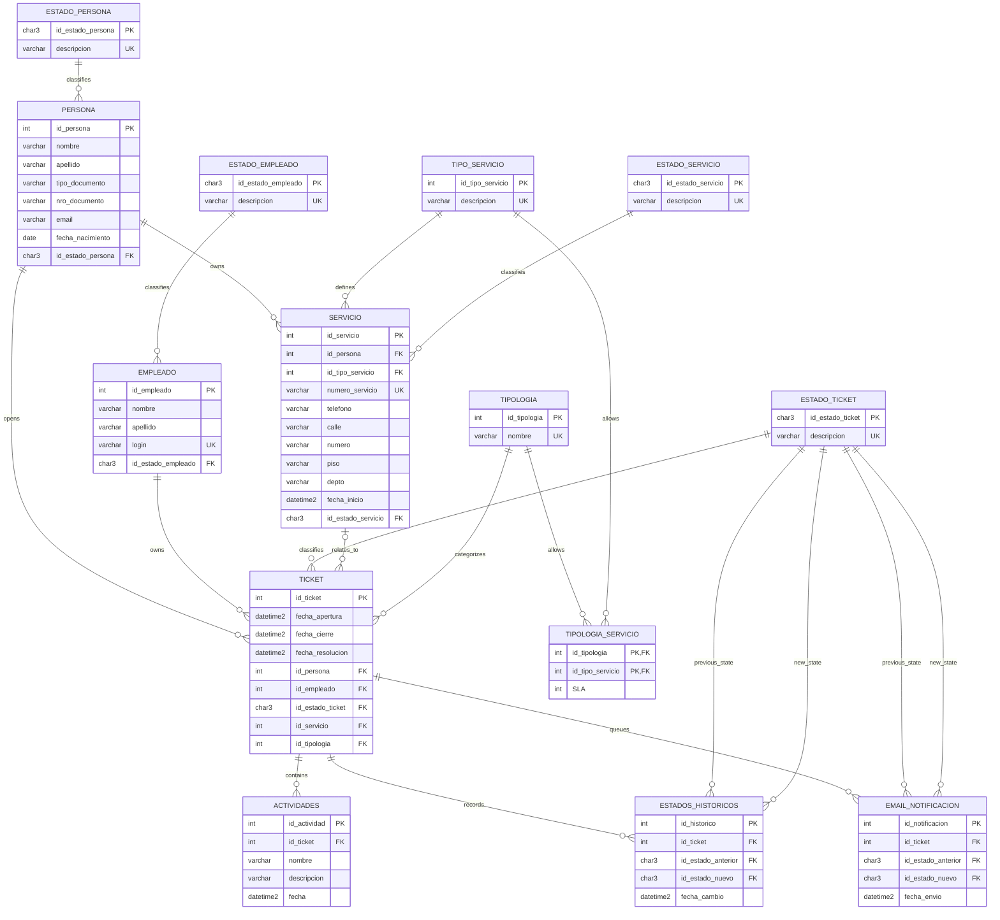
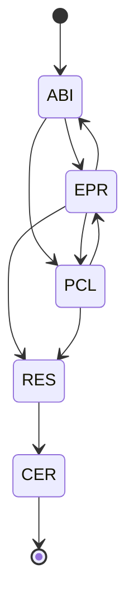
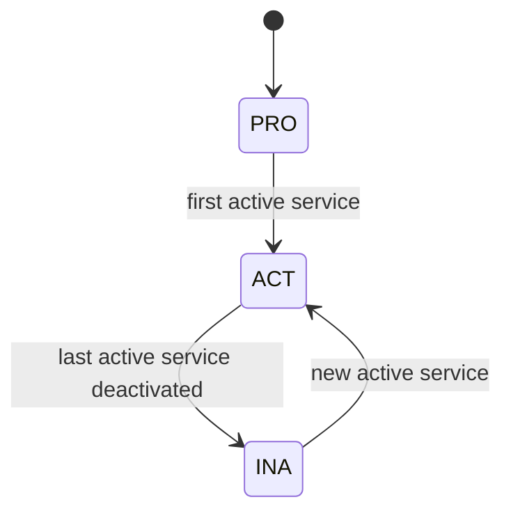

# Database Model

[🇦🇷 Versión en español](database-model.es.md)

This document describes the portfolio version of the **Telecom Call Center Database** model.

The project models people/prospects, telecom services, support tickets, employees, ticket typologies, status history, activities, SLA rules, and pending email notifications.

## Entity relationship overview



## Ticket state machine

The definitive ticket workflow is:



State codes:

| Code | Meaning |
|---|---|
| `ABI` | Open |
| `EPR` | In Progress |
| `PCL` | Pending Customer |
| `RES` | Resolved |
| `CER` | Closed |

## Person state lifecycle

People are initially created as prospects.



| Code | Meaning |
|---|---|
| `PRO` | Prospect |
| `ACT` | Active |
| `INA` | Inactive |

## SLA model

SLA is not stored directly on the ticket.

It belongs to the compatibility relationship:

```text
Tipologia + Tipo_Servicio -> SLA (hours)
```

For a ticket linked to a service, SLA is resolved from:

```text
Ticket
  -> Servicio
      -> Tipo_Servicio
  -> Tipologia
      -> Tipologia_Servicio.SLA
```

Effective resolution time is calculated as:

```text
resolution timestamp
- opening timestamp
- time spent in PCL
```

A ticket without a service has no applicable service-type SLA in this portfolio model, so SLA verification returns `NULL`.

## Integrity enforced by the database

The schema does not rely only on stored procedures.

Important invariants also exist at the database level:

- `(tipo_documento, nro_documento)` is unique per person;
- `numero_servicio` is unique;
- SLA must be greater than zero;
- resolution and closure cannot predate ticket opening;
- closure cannot predate resolution;
- a ticket service, when present, must belong to the same person as the ticket;
- status-history rows cannot record the same previous and new state;
- notification rows must represent a real state change.

These constraints complement the business validations implemented by the stored procedure layer.
